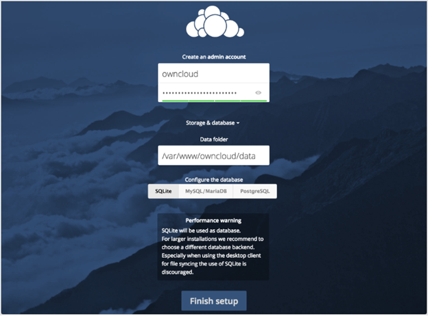
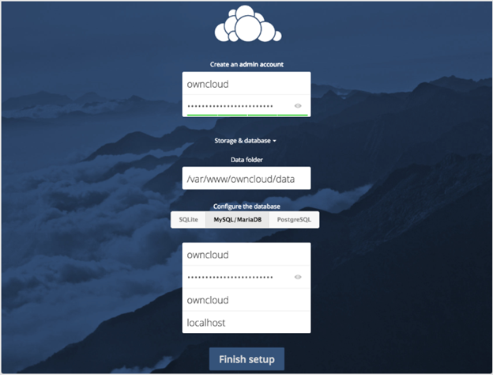
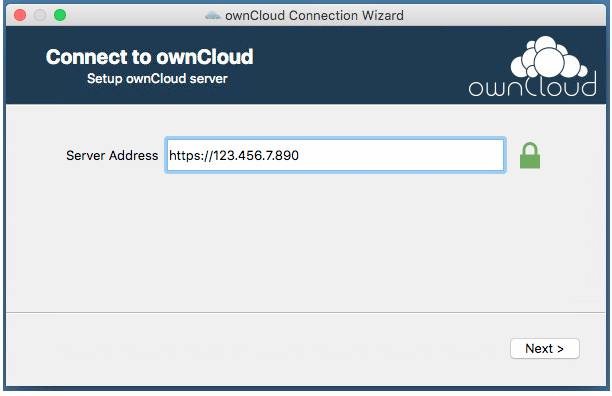
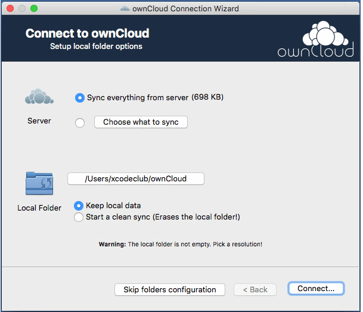

# ownCloud Overview

ownCloud is a web application that works on Linux and Unix servers. A typical installation server has Apache HTTP Server and MySQL or SQLite.

## Installing ownCloud

Here is what you need to do to set up ownCloud:

1. Click the [Download](https://download.owncloud.org/download/repositories/stable/owncloud/) page and follow the instructions to install ownCloud.
>[!NOTE] It will automatically install dependencies, such as Apache, PHP, and MySQL.

2. Once the installation is complete, click [http://localhost/owncloud](http://localhost/owncloud).

3. Type your administrator name and password.

4. Click **Storage &amp; database**.

5. Select **MySQL/MariaDB** option listed under **Configure the database**. For example, see the screenshot below:

   

6. Type the database information that you configured in the previous step. For example, see the screenshot below:

   

7. Click **Finish setup**.

Now you can start using ownCloud server.

## Adding a User Account

To add a user account:

1. Type the **username** and **password**.
>[!NOTE] You can also assign **Groups** membership.

2. Click **Create**.
> [!NOTE] Login names may contain letters (a-z, A-Z), numbers (0-9), dashes (-), underscores (\_), periods (.) and at signs (@). After creating the user, you may fill in their Full Name if it is different than the login name, or leave it for the user to complete.

## Configuring the OwnCloud Desktop Client

ownCloud makes client apps available for Windows, Linux desktops, Android, and iOS devices. Desktop clients are available from the [ownCloud](https://owncloud.org/download/) website. The apps for mobile devices are available on Google Play and the Apple App Store.

Once you have installed the desktop client for your operating system, follow these steps to configure it to sync with your ownCloud server:

1. Launch the ownCloud desktop client.

2. In the connection wizard panel, type **Server Address**.
>[!NOTE] If you did not set up HTTPS support on your server, ensure you are using http:// and not https://.

3. Click **Next** to proceed. For example, see the screenshot below:

   

4. Type the **Username** and **Password**.

5. Specify whether to sync everything for the server or only selected files. Also, specify a location for the local files to reside. For example, see the screenshot below:

   

6. Click **Connect** and then **Finish** to save the settings.
